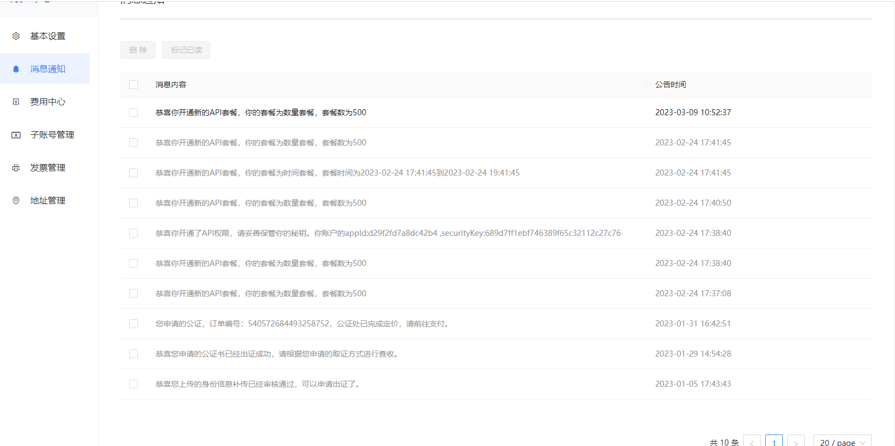

流程
=================

**第一步：联系客服开通API权限。**

**第二步：在消息中心里获取appId及securitykey**

**第三步：开始对接API接口。**

假定待签名数据头为::

    "request-id": "c62e2a71c0a24dbc8e296d579694eaaa",
    "app-id": "d29f2fd7a8dc42b4",
    "nonce": 1678345454

签名过程用Java代码描述如下::

       // 私钥文件路径
        String securityKey = "689d7ff1ebf746389f65c32112c27c76";

        // 请求头
        String requestId = IdUtil.simpleUUID();
        String appId = "d29f2fd7a8dc42b4";
        long nonce = System.currentTimeMillis() / 1000;
        // API path
        //待签名数据 = requestId+appId+nonce
        String data = requestId + appId + nonce;
        // 开始签名
        SM3 sm3 = new SM3(securityKey.getBytes());
        // 签名字符串
        String signatureData = sm3.digestHex(data);

.. note:: 签名所用的方法是SM3

签名过程用Node代码描述如下::

const { SM3 } = require("gm-crypto"); const fetch = require("node-fetch");

const requestId = generateUUId(); const appId = "xxxx"; const securityKey = "xxxxx";

const nonce = Math.floor(Date.now() / 1000);

const data = ${requestId}${appId}${nonce};

const b1 = Buffer.from(securityKey + data, "utf-8");

// 加密 const signatureData = SM3.digest(b1, undefined, "hex");

console.log(signatureData: ${signatureData})

